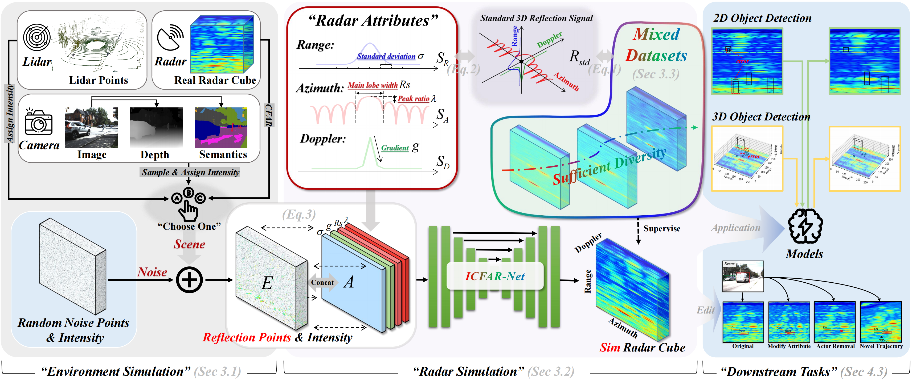

# Simulate Any Radar: Attribute-Controllable Radar Simulation via Waveform Parameter Embedding

[](https://zhuxing0.github.io/projects/SA-Radar)
[](https://zhuxing0.github.io/projects/SA-Radar)

<p align="center">
  
</p>

(a) SA-Radar enables controllable and realistic radar simulation by conditioning on
customizable radar attributes. It supports flexible scene editing such as attribute modification, actor
removal, and novel trajectories. (b) SA-Radar improves performance on various tasks including
semantic segmentation, 2D/3D object detection. In all settings, SA-Radar’s synthetic data either
matches or surpasses real data, and provides consistent gains when combined with real-world datasets.

<p align="center">
  
</p>

We present SA-Radar (Simulate Any Radar), a radar simulation approach that enables controllable and efficient generation of radar cubes conditioned on customizable radar attributes. Unlike prior generative or physics-based simulators, SA-Radar integrates both paradigms through a waveform-parameterized attribute embedding. We design ICFAR-Net, a 3D U-Net conditioned on radar attributes encoded via waveform parameters, which captures signal variations induced by different radar configurations. This formulation bypasses the need for detailed radar hardware specifications and allows efficient simulation of range-azimuth-Doppler (RAD) tensors across diverse sensor settings. We further construct a mixed real-simulated dataset with attribute annotations to robustly train the network. Extensive evaluations on multiple downstream tasks—including 2D/3D object detection and radar semantic segmentation—demonstrate that SA-Radar’s simulated data is both realistic and effective, consistently improving model performance when used standalone or in combination with real data. Our framework also supports simulation in novel sensor viewpoints and edited scenes, showcasing its potential as a general-purpose radar data engine for autonomous driving applications.

## Table of Contents

- [Environment Setup](#environment-setup)
- [Dataset Preparation](#Dataset-Preparation)
- [Evaluate the Pre-train Model](#evaluate-the-pre-train-model)
- [Train Your Model](#train-your-model)
- [Run Radar Simulation](#run-radar-simulation)
- [Notes](#notes)

## Environment Setup

First, create a new Conda environment and specify the Python version:

```bash
conda create -n radar_sim_env python=3.11.9
conda activate radar_sim_env
pip install torch==2.1.0 torchvision==0.16.0 torchaudio==2.1.0 --index-url https://download.pytorch.org/whl/cu121
pip install opencv-python
pip install scikit-image
pip install tensorboard==2.12.0
pip install matplotlib
pip install tqdm
pip install timm==0.5.4
pip install numpy==1.26.4
```

## Dataset Preparation

Please keep the same directory tree as shown in [GoogleDrive](https://drive.google.com/drive/u/1/folders/1v-AF873jP8p6waChF3pSSqz6HXOOZgkC) or [OneDrive](https://uottawa-my.sharepoint.com/personal/azhan085_uottawa_ca/_layouts/15/guestaccess.aspx?folderid=016d9f28644214b8c8813d618a3809365&authkey=ARvXPjc---r2wTFL6TEuY84&e=bwnfSO)

Download the dataset and arrange it as the folloing directory tree,
```bash
|-- train
	|-- RAD
		|-- part1
			|-- ******.npy
			|-- ******.npy
		|-- part2
			|-- ******.npy
			|-- ******.npy
	|-- gt
		|-- part1
			|-- ******.pickle
			|-- ******.pickle
		|-- part2
			|-- ******.pickle
			|-- ******.pickle
	|-- stereo_image
		|-- part1
			|-- ******.jpg
			|-- ******.jpg
		|-- part2
			|-- ******.jpg
			|-- ******.jpg
|-- test
	|-- RAD
		|-- part1
            |-- ***
	|-- gt
		|-- part1
            |-- ***
	|-- ***
```

## Evaluate the pre-train model
```python
python evaluate.py --restore_ckpt ./models/icfar-net.pth --attribute
```

## Train your model

### prepare for the mixed dataset
```python
python make_mixed_dataset_step1.py 
python make_mixed_dataset_step2.py 
```

### train and eval your model on the mixed dataset
```python
python train.py --logdir ./checkpoints/icfar_mixed_bs3_lr0.0002_50e --train_datasets raddet carrada raddet_by_mr --attribute --segment_mask_loss --l1_loss --sml1_loss
python evaluate.py --restore_ckpt ./checkpoints/icfar_mixed_bs3_lr0.0002_50e/icfar-net.pth --attribute
```

## Run-radar-simulation

### run radar simulation on RADDet train set
```python
python demo.py --restore_ckpt ./models/icfar-net.pth --save_numpy --version train --attribute
or 
python demo.py --restore_ckpt ./checkpoints/icfar_mixed_bs3_lr0.0002_50e/icfar-net.pth --save_numpy --version train --attribute
```

### Scene Editing

#### Attribute Modification

Modify the *attribute_list* in demo.py directly.

#### Novel Trajectories
```python
python demo.py --restore_ckpt ./models/icfar-net.pth --save_numpy --version train --attribute --angle_rotation
```

#### Actor Removal
```python
python demo.py --restore_ckpt ./models/icfar-net.pth --save_numpy --version train --attribute --remove
```

## notes
