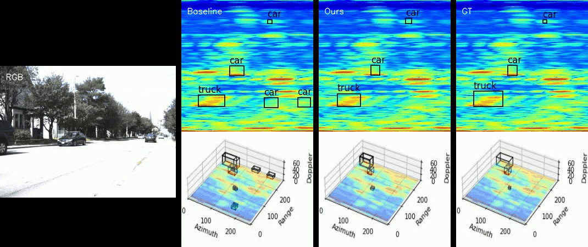

# Simulate Any Radar: Attribute-Controllable Radar Simulation via Waveform Parameter Embedding

<div align="center">
<a href="https://arxiv.org/abs/2506.03134">
  
</a>
<a href="https://zhuxing0.github.io/projects/SA-Radar">
    
</a>
</div>

This repo contains the official code of our paper: [Simulate Any Radar: Attribute-Controllable Radar Simulation via Waveform Parameter Embedding](https://arxiv.org/abs/2506.03134).

> Authors: [Weiqing Xiao](https://scholar.google.com.hk/citations?user=v0iwkScAAAAJ&hl=en&oi=sra)<sup>\*</sup>, [Hao Huang](https://github.com/HaoHuang2003)<sup>\*</sup>, [Chonghao Zhong](https://github.com/zchnanguan7)<sup>\*</sup>, Yujie Lin, [Nan Wang](https://bigcileng.github.io/), [Xiaoxue Chen](https://scholar.google.com.hk/citations?hl=en&user=_tz64W0AAAAJ), [Zhaoxi Chen](https://scholar.google.com.hk/citations?hl=en&user=HsV0WbwAAAAJ), [Saining Zhang](https://scholar.google.com.hk/citations?hl=en&user=P4efBMcAAAAJ), [Shuocheng Yang](https://scholar.google.com.hk/citations?hl=en&user=XISZWXgAAAAJ), [Pierre Merriaux](https://scholar.google.com.hk/citations?hl=en&user=NMSccqAAAAAJ), Lei Lei, [Hao Zhao](https://sites.google.com/view/fromandto/)<sup>†</sup>  

## ✨ News

- June 4, 2025: Release paper.

- June 3, 2025: Release checkpoints of ICFAR-Net and downstream models.

- June 1, 2025: Release project page.

## 📊 Overview

<p align="center">
  
</p>

(a) SA-Radar enables controllable and realistic radar simulation by conditioning on
customizable radar attributes. It supports flexible scene editing such as attribute modification, actor
removal, and novel trajectories. (b) SA-Radar improves performance on various tasks including
semantic segmentation, 2D/3D object detection. In all settings, SA-Radar’s synthetic data either
matches or surpasses real data, and provides consistent gains when combined with real-world datasets.

---

- From left to right are the RGB image and the range-azimuth slices of the radar cube for Ground-Truth, Simulation, Attribute Modification, Actor Removal, and Novel Trajectory.


- Comparison of detection results between the model trained on SA-Radar simulation data and the baseline on real sequences.



-  Comparison of detection results between the model trained on SA-Radar simulation data and the baseline on simulated sequences.


## 🚀 Table of Contents

- [Environment Setup](#environment-setup)
- [Dataset Preparation](#Dataset-Preparation)
- [Evaluate the Pre-train Model](#evaluate-the-pre-train-model)
- [Train Your Model](#train-your-model)
- [Run Radar Simulation](#run-radar-simulation)
- [Downstream Tasks](#downstream-tasks)

### Environment Setup

First, create a new Conda environment and specify the Python version:

```bash
conda create -n SA_Radar python=3.11.9
conda activate SA_Radar
pip install torch==2.1.0 torchvision==0.16.0 torchaudio==2.1.0 --index-url https://download.pytorch.org/whl/cu121
pip install opencv-python
pip install scikit-image
pip install tensorboard==2.12.0
pip install matplotlib
pip install tqdm
pip install timm==0.5.4
pip install numpy==1.26.4
```

### Dataset Preparation

Please keep the same directory tree as shown in [RADDet dataset](https://github.com/ZhangAoCanada/RADDet?tab=readme-ov-file#DatasetLink) and [Carrada dataset](https://github.com/valeoai/carrada_dataset).

Download the datasets and arrange them as the folloing directory tree,
```bash
|-- RADDet
	|-- train
		|-- RAD
			|-- part1
				|-- ******.npy
				|-- ******.npy
		|-- gt
			|-- part1
				|-- ******.pickle
				|-- ******.pickle
		|-- stereo_image
			|-- part1
				|-- ******.jpg
				|-- ******.jpg
	|-- test
		|-- RAD
			|-- ***
		|-- gt
			|-- ***
		|-- stereo_image
			|-- ***
|-- Carrada
	|-- Carrada
		|-- data_seq_ref.json
		|-- 2019-09-16-12-52-12
			|-- annotations/box/range_angle_light.json
			|-- annotations/box/range_doppler_light.json
		|-- 2019-09-16-12-55-51
			|-- annotations/box/range_angle_light.json
			|-- annotations/box/range_doppler_light.json
		|-- ***
	|-- datasets_master
		|-- Carrada_RAD
			|-- 2019-09-16-12-52-12
				|-- RAD_numpy
					|-- 000000.npy
					|-- 000001.npy
					|-- ***
			|-- 2019-09-16-12-55-51
			|-- ***
```

### Evaluate the pre-train models
```python
python evaluate.py --restore_ckpt ./models/icfar-net.pth --attribute
or
python evaluate.py --restore_ckpt ./models/icfar-net_trained_by_A.pth --attribute
or
python evaluate.py --restore_ckpt ./models/icfar-net_trained_by_B.pth --attribute
or
python evaluate.py --restore_ckpt ./models/icfar-net_trained_by_C.pth --attribute
```

### Train your model

#### prepare for the mixed dataset
```python
python make_mixed_dataset_step1.py 
python make_mixed_dataset_step2.py 
```

#### train and eval your model on the mixed dataset
```python
python train.py --logdir ./checkpoints/icfar_mixed_bs3_lr0.0002_50e --train_datasets raddet carrada raddet_by_mr --attribute --segment_mask_loss --l1_loss --sml1_loss
python evaluate.py --restore_ckpt ./checkpoints/icfar_mixed_bs3_lr0.0002_50e/icfar-net.pth --attribute
```

### Run-radar-simulation

#### run radar simulation on RADDet train set
```python
python demo.py --restore_ckpt ./models/icfar-net.pth --save_numpy --version train --attribute
or 
python demo.py --restore_ckpt ./checkpoints/icfar_mixed_bs3_lr0.0002_50e/icfar-net.pth --save_numpy --version train --attribute
```
#### run radar simulation on NuScene v1 mini
```python
python demo_on_NuScenes.py --restore_ckpt ./models/icfar-net.pth --attribute --time_steps 100
or
python demo_on_NuScenes.py --restore_ckpt ./models/icfar-net_wo-re.pth --time_steps 100
```

#### Scene Editing

##### Attribute Modification

Modify the *attribute_list* in `demo.py` directly.

##### Novel Trajectories
```python
python demo.py --restore_ckpt ./models/icfar-net.pth --save_numpy --version train --attribute --angle_rotation
```

##### Actor Removal
```python
python demo.py --restore_ckpt ./models/icfar-net.pth --save_numpy --version train --attribute --remove
```

### Downstream Tasks

We provide pre-trained weights of the models on different downstream tasks in the [downstream_ckps](downstream_ckps) folder, including real-data-trained, simulated-data-trained, and co-trained versions.

#### Running a Pre-trained Model and Training Your Downstream Model

After running `demo.py`, the generated simulation data is saved to the `./sim_output` folder (set via *--output_directory*). The simulation data format is identical to the RADDet dataset, which you can use to train your downstream model.

For 3D detection, copy `./downstream_ckps/RADDet_Pytorch/*` files and the checkpoints from `./downstream_ckps/3d-det` folder into [RADDet_Pytorch](https://github.com/auroua/RADDet_Pytorch) and run:
```python
# Running a Pre-trained Model with a RAD head on RADDet or Carrada
python validate_SA_Radar.py --dataset RADDET --config_dir ./configs/config_simraddet_1000e_final.json --resume_from {RAD_ckp_path}
python validate_SA_Radar.py --dataset CARRADA --config_dir ./configs/config_simcarrada_1000e_final.json --resume_from {RAD_ckp_path}

# Training Your Model with a RAD head on RADDet or Carrada
python train_SA_Radar.py --dataset RADDET --config_dir ./configs/config_simraddet_1000e_final.json --add_train_dir {sim_data_path}(optional)
python train_SA_Radar.py --dataset CARRADA --config_dir ./configs/config_simcarrada_1000e_final.json --add_train_dir {sim_data_path}(optional)

# Running a Pre-trained Model with a RA head on RADDet or Carrada (To be uploaded)
python validate_cart_SA_Radar.py --dataset RADDET --config_dir ./configs/config_simraddet_1000e_final.json --resume_from {RA_ckp_path}
python validate_cart_SA_Radar.py --dataset CARRADA --config_dir ./configs/config_simcarrada_1000e_final.json --resume_from {RA_ckp_path}

# Training Your Model with a RA head on RADDet or Carrada (To be uploaded)
python train_cart_SA_Radar.py --dataset RADDET --config_dir ./configs/config_simraddet_1000e_final.json --backbone_resume_from {RAD_ckp_path} --add_train_dir {sim_data_path}(optional)
python train_cart_SA_Radar.py  --dataset CARRADA --config_dir ./configs/config_simcarrada_1000e_final.json --backbone_resume_from {RAD_ckp_path} --add_train_dir {sim_data_path}(optional)

```

For 2D detection (RD), copy the config and checkpoint files from `./downstream_ckps/2d-det (RTMDet Model on mmdet)` folder into [mmdetection](https://github.com/open-mmlab/mmdetection), and run:
```python
python tools/test.py --config configs/{config.py} --checkpoint work_dirs/{model.pth}
```

# 🤝 Citation

If you find this repository helpful, please consider citing our paper:

```bibtex
@article{xiao2025simulate,
  title={Simulate Any Radar: Attribute-Controllable Radar Simulation via Waveform Parameter Embedding},
  author={Xiao, Weiqing and Huang, Hao and Zhong, Chonghao and Lin, Yujie and Wang, Nan and Chen, Xiaoxue and Chen, Zhaoxi and Zhang, Saining and Yang, Shuocheng and Merriaux, Pierre and others},
  journal={arXiv preprint arXiv:2506.03134},
  year={2025}
}
```

